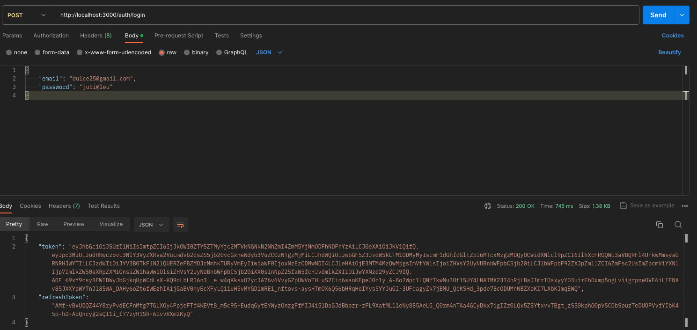

# Authentication Service 
[](https://skillicons.dev)

Authentication Service is a Node.js microservice responsible for user authentication. It interacts with the users-service microservice to handle user-related operations such as registration, login, and profile management. This service follows a microservices architecture and includes middleware to validate request parameters.

## Features

- User authentication (login)

## Technologies Used

- Node.js
- Express.js
- Microservices architecture
- Middleware for parameter validation

## Installation

1. Clone the repository:

   ```bash
   git clone https://github.com/devmaiko/authorization-service-js.git
   ```

2. Install dependencies:

   ```bash
   cd authentication-service
   npm install
   ```

3. Set up environment variables. See the Configuration section below for details.

4. Run the service:

   ```bash
   npm start
   ```

## Configuration

The service requires configuration for communicating with the users-service microservice. You can provide configuration using environment variables or configuration files.

### Users Service Configuration

Set the URL of the users-service microservice using the `USERS_SERVICE_URL` environment variable.

```bash
USERS_SERVICE_URL=http://users-service-url:port
```

## Usage

The service exposes HTTP endpoints for user authentication operations. Here are some example endpoints:

- `POST /api/auth/login`: Authenticate a user and generate an authentication token.
  
## Middleware for Parameter Validation

The service includes middleware to validate request parameters before processing them. This ensures that only valid data is accepted by the service. You can find the middleware in the `middlewares/validateParams.js` file.

## Contributing

Contributions are welcome! If you'd like to contribute to Authentication Service, please follow the standard GitHub flow: fork the repository, make changes, and submit a pull request.
